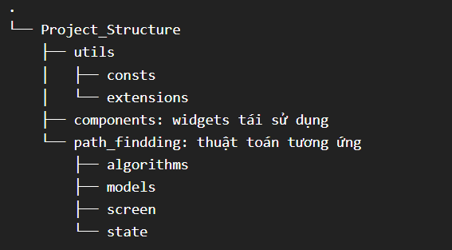

## 📚 Giới thiệu
Ứng dụng giúp trực quan hóa các thuật toán.
Mục tiêu là giúp người học dễ dàng quan sát cách thuật toán hoạt động.

---

## ⚙️ Thuật toán được hỗ trợ

### `Tìm đường đi`
- **BFS (Breadth-First Search)**
- **DFS (Depth-First Search)** 
- **Dijkstra** 

    > 🧩 Các thuật toán đều chạy trên **ma trận 2D** và hiển thị quá trình duyệt, tô màu trạng thái từng ô (start, finish, wall, visited, ...).

---

## 🗂️ Cấu trúc thư mục
[Sửa](https://tree.nathanfriend.com/?s=(%27options!(%27fancy!true~fullPat4trailingSlas4rootDot!true)~6(%276%27Project_Structure03util73const73extensions0.components%3A%20widgets2%C3%A1i%20s%E1%BB%AD%20d%E1%BB%A5ng0.path_findding%3A2hu%E1%BA%ADt2o%C3%A1n2%C6%B0%C6%A1ng%20%E1%BB%A9ng*.algorithm7.model7.screen*.state5%27)~version!%271%27)*53-%200%5Cn%202%20t3%20.4h!false~50%20%206source!7s*%017654320.*)

